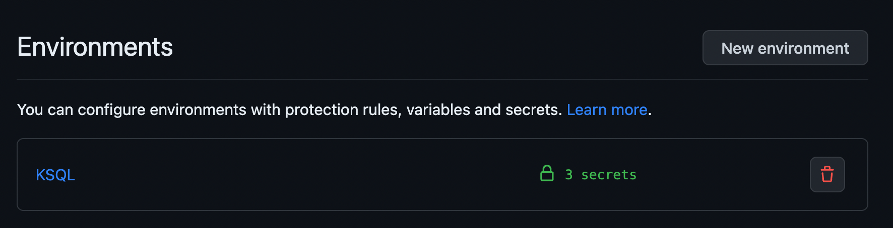
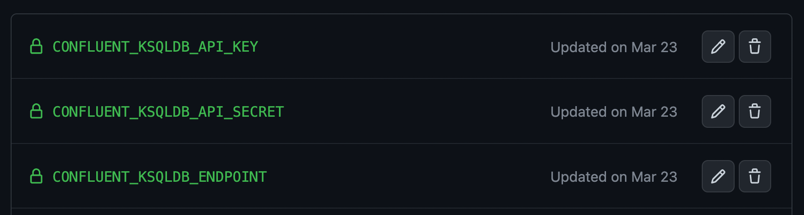

# Ksqldb-CICD

This project tries to present a real example of a CI/CD flow for a ksql application.

## Components

1. Github repository
2. Github secret
3. Confluent Cloud kafka cluster
4. Confluent Cloud ksql cluster
5. Scripts & docker to support Github actions
6. Github workflow $ actions
7.

### Github repository

The repository is divide in the following folders.

* .github --> Folder for github actions and workflows
* docker  --> Some github actions use a custom docker image. In this folder is the docker file to create this imageIn this folder
* migrations --> The [ksql-migrations](https://docs.ksqldb.io/en/latest/operate-and-deploy/migrations-tool/https:/) tool uses this folder to store all migrations projects. This project are named according to the convention `V<six digit version>__<description>.sql`
* scripts --> Some github actions need an extra step to integrate confluent tools.
* unit_tests --> ksqlDB exposes a *test runner* command line tool to automatically test it. Then in this folder we will store all the unite test for each migration project. The name convetion is similar to migrations project `V<six digit version>__<description>.sql`

### Github secret

There are some actions that you need credentials to be executed. One of the objectives of this project is that the deployment of ksql applications itself be managed from a single point. With this, only the **Github action** itself will have access to the ksql cluster.

Github Secrets are variables that you create in an organization, repository, or repository environment. The secrets that you create are available to use in GitHub Actions workflows. GitHub Actions can only read a secret if you explicitly include the secret in a workflow.

For further detail read the following [link](https://docs.github.com/en/actions/security-guides/encrypted-secrets#creating-encrypted-secrets-for-an-environmenthttps:/).

1. Create an environment named **KSQL**

3. Create 3 environments secrets

* CONFLUENT_KSQLDB_API_KEY
* CONFLUENT_KSQLDB_API_SECRET
* CONFLUENT_KSQLDB_ENDPOINT

For more informatin read the confluent [Documentation](https://docs.confluent.io/cloud/current/access-management/authenticate/api-keys/api-keys.html).

# Reset the environment

docker run --rm -it -v ${PWD}:/tmp/juan jsotocf/ksql-juan:v1 bash
