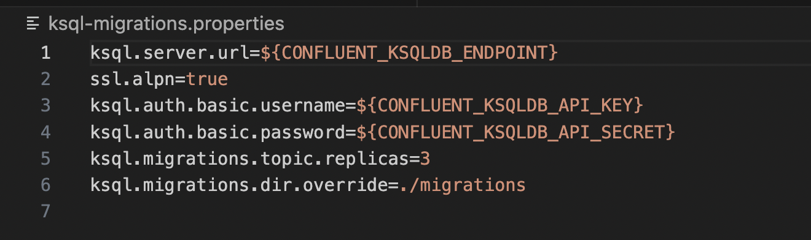

# Ksqldb-CICD

This project tries to present a real example of a CI/CD flow for a ksql application.

## Components

1. Github repository
2. Github secret
3. Confluent Cloud kafka cluster
4. Confluent Cloud ksql cluster
5. Ksql tools
6. Scripts to support Github actions
7. Github workflow & actions
8.

### Github repository

The repository is divide in the following folders.

* .github --> Folder for github actions and workflows
* docker  --> Some github actions use a custom docker image. In this folder is the docker file to create this imageIn this folder
* migrations --> The [ksql-migrations](https://docs.ksqldb.io/en/latest/operate-and-deploy/migrations-tool/https:/) tool uses this folder to store all migrations projects. This project are named according to the convention `V<six digit version>__<description>.sql`
* scripts --> Some github actions need an extra step to integrate confluent tools.
* unit_tests --> ksqlDB exposes a *test runner* command line tool to automatically test it. Then in this folder we will store all the unite test for each migration project. The name convetion is similar to migrations project `V<six digit version>__<description>.sql`

### Github secret

There are some actions that you need credentials to be executed. One of the objectives of this project is that the deployment of ksql applications itself be managed from a single point. With this, only the **Github action** itself will have access to the ksql cluster.

Github Secrets are variables that you create in an organization, repository, or repository environment. The secrets that you create are available to use in GitHub Actions workflows. GitHub Actions can only read a secret if you explicitly include the secret in a workflow.

For further detail read the following [link](https://docs.github.com/en/actions/security-guides/encrypted-secrets#creating-encrypted-secrets-for-an-environmenthttps:/).

1. Create an environment named **KSQL**
   
2. Create 3 environments secrets
   

* CONFLUENT_KSQLDB_API_KEY
* CONFLUENT_KSQLDB_API_SECRET
* CONFLUENT_KSQLDB_ENDPOINT

For more informatin read the confluent [Documentation](https://docs.confluent.io/cloud/current/access-management/authenticate/api-keys/api-keys.html).

### Confluent Cloud kafka cluster

Confluent Cloud is a resilient, scalable, streaming data service based on Apache Kafka®, delivered as a fully managed service.

Further detail about how to start with Confluent Cloud in the following [link](https://docs.confluent.io/cloud/current/get-started/index.htmlhttps:/).

### Confluent Cloud ksql cluster

Confluent Cloud offers a fully managed, cloud-native platform for data in motion powered by Apache Kafka®. Spin up ksqlDB clusters on demand with pay-as-you-go pricing.

This [link](https://docs.confluent.io/cloud/current/get-started/index.html#section-2-add-ksql-cloud-to-the-cluster) uses the Cloud Console to create a ksqlDB cluster.

### Ksql tools

As described earlier in this readme, two ksql tools are used.

* [ksql-migrations](https://docs.ksqldb.io/en/latest/operate-and-deploy/migrations-tool/https:/). You can configure the ksqlDB migrations tool by updating your `ksql-migrations.properties`
  In this file, we will use the github envieronment secrest

  

  In this way, all the deployment will be centralized in a single place, github.
* [ksql-test-runner](https://docs.ksqldb.io/en/latest/how-to-guides/test-an-app/)

### Scripts & docker to support Github actions

There are two scripts used to help the github action iterations:

1. apply.sh The script execute ksql-migrations tool on dry-run mode or normal. In case, ksql-migration return an error, the script will **exit with code 1**.
2. unitTests.sh. For each application in the migrations directory, the script checks that there are three files: with the same name, the same name finishing in input, the same name finishing in output. If it does not find these three files, finish with **exit 1**. Also, if any of the unit test fails the script **exit with code 1**.

### Github workflow & actions

Three workflows has created:

#### Create File

The name of this file is migrate-cloud-ksqldb2.yaml

This workflow aims to create a blank migration file according some inputs.

The steps they execute are the following:

1. Checkout repository. We reuse one of the actions that you can find in the marketplace, *actions/checkout@v2*.
   This action checks-out your repository under `$GITHUB_WORKSPACE`, so your workflow can access it.
   Further detail in the [link](https://github.com/actions/checkout).
2. Replace Environment Variables Action. 

# Reset the environment

docker run --rm -it -v ${PWD}:/tmp/juan jsotocf/ksql-juan:v1 bash
